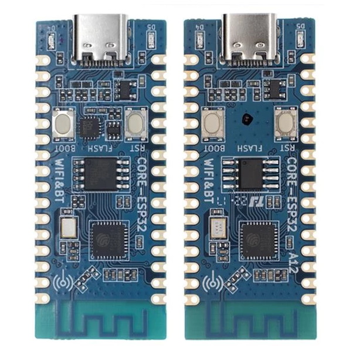
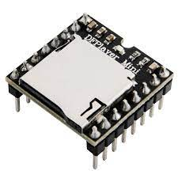
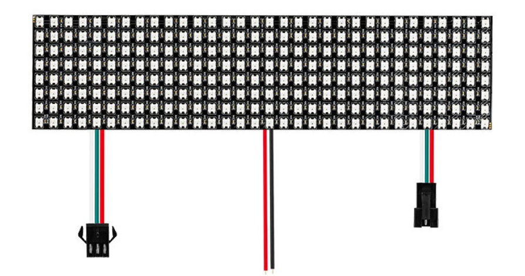
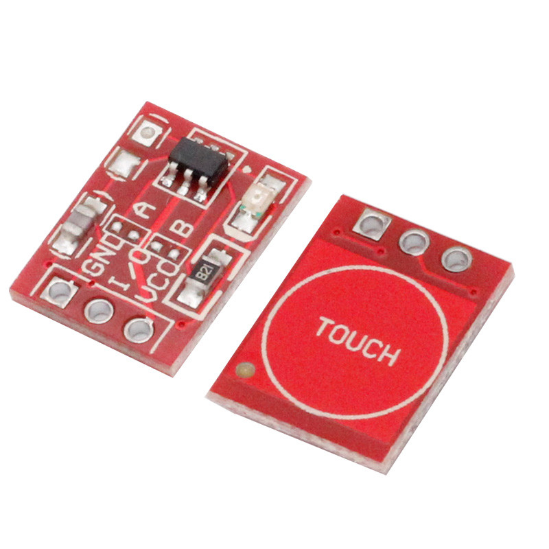
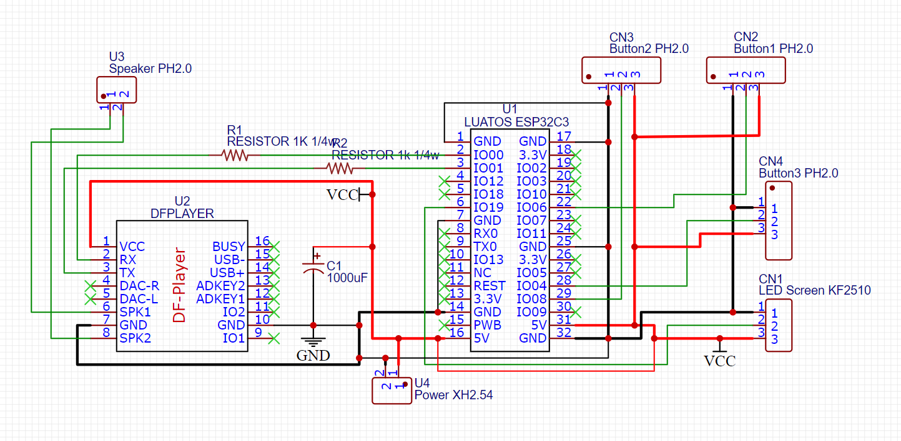

# Internet Clock Personal Project

Hi, I'm Nemo.

First of all, I want to thank my dad. Without him, working on this project by myself will not even be <u>posibal</u>.


## Hardware ref

· ESP32-c3 (made by LUATOS) 



· DFPLAYER 



· Speaker


· WS2812 Screen 



· Touch buttons




## Wiring



PS: With this PCB file, you sholf be able to manufacture this board by youself. Find it in the 'PCB' folder with name 'Gerber_PCB_Internet clock PCB 1_2022-08-31.zip'.


Internet Clock is a project I made together with my father, and I would like to thank him for his help, without which it would have been very difficult for me to make this project work.
The original idea of Internet Clock was quite simple, to design a clock that could adjust the time by itself. The more peculiar features were made by taking into account the buttons and other elements and combining them with our own creativity.
The Internet Clock has a total of 3 buttons and 4 functions. The most basic, and so the clock needs to do, is a clear display of the time (initial setting is UTC+8 time zone), arranged as "hours : minutes : seconds". The second function is to press the first button (from left to right) to switch the display on top of the screen, changing the normal time to the current date. If you wish to change back, just press the first button as well.


## Frameware version:

Micropython v1.19.1

https://micropython.org/resources/firmware/esp32c3-20220618-v1.19.1.bin


## Method:

```python
clean()
show()
light_on(x, y, color = (50, 50, 50))
translate(x, y)
show_digi(x, y, digital = 0, color = (50, 50, 50))
print_text(text = 'Hi', x = 3, y = 1)
clock_init(timer=None)
padding(num)
sync_time(timer=None)
show_time(timer=None)
date_time_button_handler(pin)
sound_button_handler(pin)
ball_button_handler(pin)
```


Give creadit to:

https://github.com/lavron/micropython-dfplayermini

https://github.com/anson-vandoren/esp8266-captive-portal