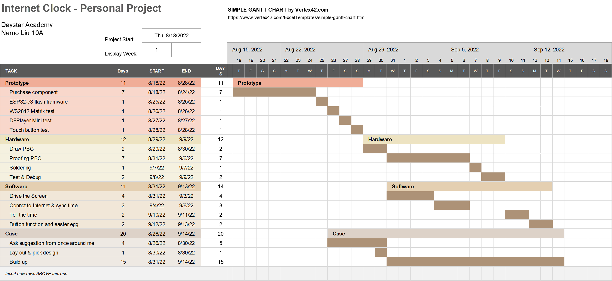

# Internet Clock

### ! Attention:

### The author have only programmed this program through with a windows 11 operating system.  There might be mistakes and place that won't work out for you, you might need to adapt to some of the changes by yourself.

## Project's initial

The whole thing started when a day in the June, my mom complained about the clock we got in the center of the room was not working all the time, and when ever she is reseating up the clock, by changing battery, she needs to do the readjusting time process (adjust it to the current time). Which inspired me the idea of wanting to have a clock of main that can work without this whole process of setting up the clock. Although the idea of spending serval days working on this project just to fix this problem seems dumb,  but actually it is not. The process of resetting a clock is not that complex or takes much time to do, it is just a simple thing that will makes you depressed and tuned all the good mood of the day especially if it happens in the morning, when you are caching up the time to go to school or work, which can be really frustrating. 

The opportunity of Personal Project to learning about programming. 

In a normal situation, clock have errors with time. Even though keep the time in track is purpose of the clock, but in the most case errors do exist. After a few month or so, it will need a adjustment on the time. It can be freak people out if it happens. So, after we find a problem, then we need to find a way to fix it. That is where me and the Internet Clock comes in. I want to challenge myself by working on this clock, which contains multiple techniques that I never learned before. It is existing. 

When I go over this whole thing with my dad, a professional software developer, tries to gets some idea of where should I get this started. He told me that I could try find open sources projects on GitHub, which contains all sorts of developer who shared their own unique projects. So, after I learned a couple of things from my dad, about how should I find information on GitHub. Then I started browsing on GitHub. After a few hours of searching, finally find a project named "AWTRIX1.0" (key word "Matrix Clock"), with the 113 stars (a system allows user to support author, similar as the "like button" in YouTube). Through "AWTRIX1.0" 's readme.md document, we would know that there is a 2.0 version of this project and the 1.0 one, is already outdated. After reading through the 2.0 version we would know that, in his design, he plans to clock able to show the time and keep the time updated, also provided the function of allowing it's user to create unique function and share it with other user. On the other hands,  we find out that what he have done in his project is way too powerful but at the same time, it is too complex. We can see evidence of it is complex in multiple places,

1. Powerful Hardware, but not nassary.

   1. Serial connection or USB connection to the matrix

   2. Gesture sensor for operation (optional)

   3. Temperature and humidity sensor (optional)

   4. Light sensor for brightness control (optional)

2. Useful Functions, but need "host"

   1. In his design, he have provided many useful functions that would help and make the screen have more variability. However, we need to setup the host first. The host is a program that need to be on at the whole time in order to keep the clock(controller) running. Which means, if you want this clock to be on, you PC should also be on the whole time. 

So, after discussion with my dad about the details of the personal project, he suggest me to work on a rather smaller and simpler project than this one. I listen what he recommended, then approached my own project according to AWTRIX's hardware. I named it -- Internet Clock. The reason I have named it "Internet clock" is because I want it to show the exact time of the day and date, with out losing track of time by sync current time through NTP server. Just like what a phone dose. After a time of thinking, I have **seted** up 3 goals.

First, my clock should be able to auto sync the time by using connection with a NTP server. Which is a server runs exsac time.

Second, it should be able to call out time during each hour (in the range of 7 am  in the morning to 22 pm in the night).'

Third, it should be able to show the exact time of the day by using WS2812 matrix screen, in a fine order for people to read and identify the time.

After Listed out our goal and expectation for internet clock. It time to come up with a plan.




Difficulties I have encountered during the way & how did I face and fix it.


## Hardwire Component

#### List of Component

| id   |  Component's Name(name in the passage)   |      Used for       | Amount used |
| ---- | :--------------------------------------: | :-----------------: | :---------: |
| 01   |         LUATOS ESP32-c3 (esp32)          |  micro controller   |      1      |
| 02   |         DFPlayer mini(DF player)         |     sound model     |      1      |
| 03   |          Micro SD card(TF card)          | sound track restore |      1      |
| 04   | TTP223 touch button model (touch button) |    touch button     |      3      |
| 05   |            Speaker (speaker)             |     play sound      |      1      |
| 06   | WS2812 Matrix Screen (8*32 pix) (screen) |    display time     |      1      |

(all the hardwire component above are bought from Taobao)

#### Installation of Micropython Firmware

In order to get started with micropython on the "esp32" main bord, you would have to install and set up the basis for our future programming. Here are the steps: 

1. Download and setup python (done before hands)

2. Use "pip" command in python, to get download "esptool".

3. Gide yourself to the website "https://micropython.org/download/esp32c3/".

4. Download the most resent update for the firmware (I used v1.19.1(2022-06-18).bin).

5. Before cleaning up the date that was left in "esp32" by the compony, you need to looked up which port it is using.

   1. right click "my computer" find the "menage" option in context menu.

   2. now you should able to see a list of stuff under "computer manager (loco)", find "device manager" -> "port".

   3. Pulge in the device(esp32), you should be able to see the fight device poped up on your screen, at the end of the list of words, there is the right Port.

      

   4. Remember the port for you (mine is COM4).

6. After getting the port, you should open up windows terminal.

7. Make sure your device is connect to your computer, then enter this command (remember to enter the right port for you):

   ```bash
   esptool.py --chip esp32c3 --port com4 erase_flash
   ```

8. When it is successfully done, you would find some thing similar with this:

   ```text
   esptool.py v3.0
   Serial port com4
   Connecting....
   WARNING: This chip doesn't appear to be a ESP32-C3 (chip magic value 0x1b31506f). Probably it is unsupported by this version of esptool.
   Chip is unknown ESP32-C3
   Features: Wi-Fi
   Crystal is 40MHz
   MAC: 60:55:f9:7e:5f:b0
   Uploading stub...
   Running stub...
   Stub running...
   Erasing flash (this may take a while)...
   Chip erase completed successfully in 0.0s
   Hard resetting via RTS pin...
   ```

9. Now congratulation :) , you have successfully delete what ever was left in the chip, now is time for you to setup the firmware. 

10. Reminder, plz make sure you have done step 4 already. Enter:

    ```bash
    esptool.py --chip esp32c3 --port com4 --baud 460800 write_flash -z 0x0 esp32c3-20220117-v1.18.bin
    ```

11. You should be expecting following masage to shown you are correct:

    ```text
    esptool.py v3.0
    Serial port com4
    Connecting....
    WARNING: This chip doesn't appear to be a ESP32-C3 (chip magic value 0x1b31506f). Probably it is unsupported by this version of esptool.
    Chip is unknown ESP32-C3
    Features: Wi-Fi
    Crystal is 40MHz
    MAC: 60:55:f9:7e:5f:b0
    Uploading stub...
    Running stub...
    Stub running...
    Changing baud rate to 460800
    Changed.
    Configuring flash size...
    Compressed 1437472 bytes to 872137...
    Wrote 1437472 bytes (872137 compressed) at 0x00000000 in 20.7 seconds (effective 554.8 kbit/s)...
    Hash of data verified.
    
    Leaving...
    Hard resetting via RTS pin...
    ```

## Softwire Development Environment

#### hi


## Credit for

I have used some of other people's work on the way or in this project, so I will list it out:


I would like to give credit for the list of people, with out them, this project will not be possible.


# Draft 草稿部分

#### 向老师提问


